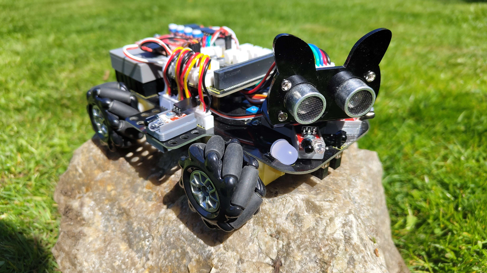

[](https://classroom.github.com/a/V-0A61vX)

[IR]: </assets/markdown/ir_setup.md>
[models]: </assets/markdown/models_download.md>
[crimping]: </assets/markdown/crimping_cables.md>
[nuts]: </assets/markdown/nut_insertion.md>
[charge]:</assets/markdown/charging_setup.md>

# Wall Detection and Integrated Charging addition for KS4031 Keyestudio 4WD Mecanum Robot Car



The **[wall detection][IR]** feature uses sensors to detect the presence of obstacles in 180° radius such as walls and other objects in the car's path, allowing the car to automatically stop or change its direction to avoid collisions. This feature can be particularly useful in situations where the car is operating in a confined space or navigating through a complex environment like Maze.

The **[integrated charging][charge]** through Micro-USB can save time and improve convenience by allowing users to quickly and easily recharge the car without the need for additional equipment or cables. 

## Documentation
- **[Download Models][models]**
- [How to set-up wall detection][IR]
- [How to set-up integrated charging][charge]
- [Nut insertion][nuts]
- [Cable crimping][crimping]

---

## Functionality test

```js
let front_P = pins.digitalReadPin(DigitalPin.P0);
let front_L = pins.digitalReadPin(DigitalPin.P7);
let left = pins.digitalReadPin(DigitalPin.P12);
let right = pins.digitalReadPin(DigitalPin.P13);

console.log("front_P: " + front_P);
console.log("front_L: " + front_L);
console.log("left: " + left);
console.log("right: " + right);
```
The given code snippet assigns the digital readings from the IR sensors to respective variables: front_P, front_L, left, and right. The console.log statements display the values of each sensor to the Console.


--- 

### TO-DO 
 - [x] welcome photo
 - [ ] Reference photo for IR
 - [ ] Reference photo for charger
 - [ ] Box for [Charger][charge]
 - [ ] Tutorial .MD for charger
